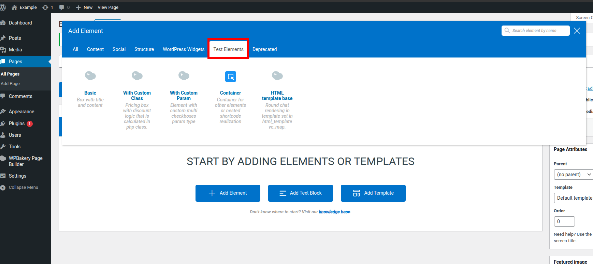

# WPBakery: Kitchen sink custom elements


## Description

This WordPress plugin demonstrates how to create custom elements for the [WPBakery Page Builder](https://wpbakery.com). It includes simple and essential examples covering common use cases, making it a helpful starting point for developers extending WPBakery with their own elements.

---

## How To Install

Clone this repo to your wp-content/plugins folder of your wordpress project.
```bash
git clone https://github.com/wpbakery/dev-example.git
```
Then go to wordpress dashboard plugins section, and activate the newly installed "WPBakery: Kitchen sink custom elements" plugin there.

Alternatively, if you have WP-CLI set up, you can install and activate the plugin using a terminal command.
```bash
wp plugin install https://github.com/wpbakery/dev-example/archive/refs/heads/main.zip --activate --force;
wp plugin activate dev-example;
```

After plugin activation, you can find all plugin elements in the "Test Elements" category in the WPBakery editor.


## Elements

### 1. **Basic**
- **File:** `elements/basic`
- **Description:**
  - A simple box element with a title and content.
  - Customizable background and text color.
  - Uses standard WPBakery parameters for easy editing.
  - Output is styled with padding, border radius, and box shadow.

### 2. **With Custom Class**
- **File:** `elements/with-custom-class`
- **Description:**
  - Pricing box element with discount logic handled in a custom PHP class.
  - Parameters for title, base price, discount, label, background color, and features list.
  - Demonstrates how to extend element logic using PHP classes.

### 3. **With Custom Param**
- **File:** `elements/with-custom-param`
- **Description:**
  - Element featuring a custom parameter type (multi-checkboxes).
  - Lets users select one or more options via custom radio/checkbox UI in the WPBakery editor.
  - Shows how to register and use custom param types in WPBakery.

### 4. **HTML Template Base**
- **File:** `elements/html-template-base`
- **Description:**
  - Show how use html_template vc_map param to renders output using a separate HTML template file.

### 5. **Container**
- **File:** `elements/container`
- **Description:**
  - A container element that allows nesting of other elements.
  - Container supports background color customization.
  - Demonstrates use of `as_parent` and `is_container` for nested/child elements in WPBakery.

---
